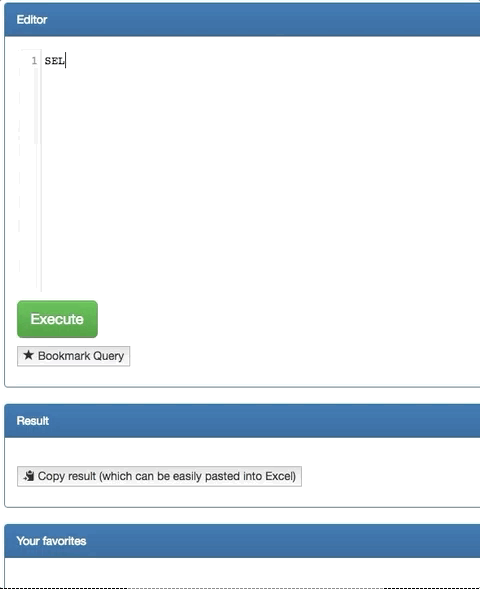

# Usage
# Features
## Auto-Completion
## History
## Bookmarks
Click on <b>Bookmark Query</b> or press <b>alt+b</b> to bookmark your query. Once a query is bookmarked, it will appear in auto-completion.

The bookmarks are kept in the local storage of the browser, so that they are available even if the computer is restarted. 
## Shortcuts
